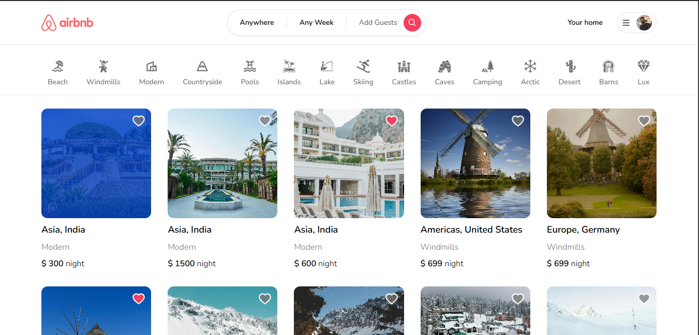
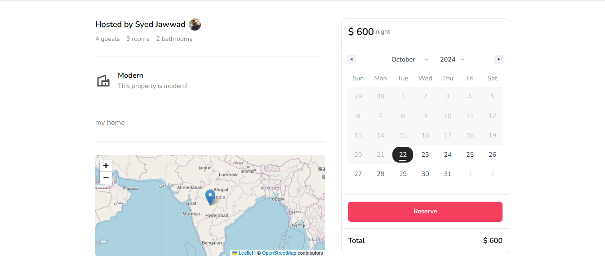
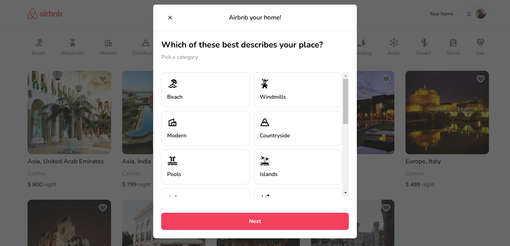
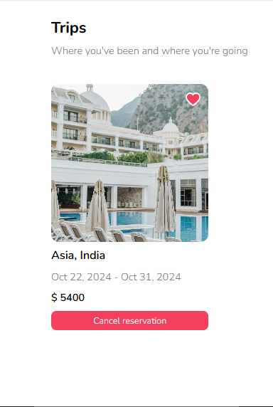

# Airbnb Clone

**Airbnb Clone** is a web application that replicates the core functionalities of Airbnb, enabling users to book and list properties, manage reservations, and explore locations. Built with modern web technologies, this project focuses on performance, user experience, and responsiveness.

## Features
- **Tailwind CSS** for modern design and animations
- Fully responsive UI
- **Credential authentication** (Google and GitHub)
- Image upload with **Cloudinary CDN**
- Client-side form validation via **react-hook-form**
- Server-side error handling with **react-toast**
- Booking and reservation system (guest and owner cancellations)
- Advanced search filters (category, date range, location, guest count, rooms, bathrooms)
- **Favorites system** and shareable URL filters
- Data fetching directly in server components (Next.js 13)
- Optimized for **Next.js 13** features (error.tsx, loading.tsx)
- **Pricing calculation** and advanced search logic
- Handles complex relational data between server and child components

## Screenshots
Here are some screenshots of the Airbnb Clone application:

### Homepage


### Filter by Maps


### Filter by Category


### Make Reservations


### Property Listings


### Favorite Listings


### Cancel Reservations Anytime


## Prerequisites
- **Node.js** version 14.x or higher
- A **.env** file with the following environment variables:
  ```bash
  DATABASE_URL=
  GOOGLE_CLIENT_ID=
  GOOGLE_CLIENT_SECRET=
  GITHUB_ID=
  GITHUB_SECRET=
  NEXTAUTH_SECRET=
```

## Cloning the Repository
```
git clone https://github.com/MohammedJawwad/Airbnb-Clone.git
```
## Installing Packages
```bash
npm install
```
## Setting up Prisma
```bash
npx prisma db push
```
## Starting the Application
```bash
npm run dev
```
## Available Commands
Here are the available commands for managing the application:

| Command  | Description                              |
|----------|------------------------------------------|
| `dev`    | Starts the development instance of the app. |
| `build`  | Builds the app for production.           |
| `start`  | Runs the production build.               |

